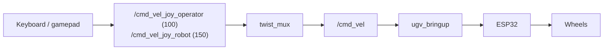

# Keyboard & Gamepad Control

Real-time driving — gamepad in **T1** (`teleop_twist_joy.launch.py`), or keyboard in **T1** (`keyboard_ctrl`). See [Launch teleop](#launch-teleop) for terminal order.

Neither one publishes **`/cmd_vel`** directly any more: both feed **`twist_mux`**, which arbitrates every velocity source down to one **`/cmd_vel`** stream. Gamepad-on-the-robot outranks keyboard, and both outrank autonomy. See [Command Arbitration](command_arbitration.md) for the full ladder.

For bringup and serial, see [Hardware Driver](bringup.md).

---

## Prerequisites

1. **Build and source** **`ugv_ws`** ([Installation](installation.md)).
2. Set **`UGV_MODEL`** and **`LDLIDAR_MODEL`** — see [environment variables](index.md#product-names-vs-environment-variables).

!!! warning "Safety"
    With **`ugv_bringup`** running, the chassis **moves as soon as you press drive keys or move the sticks**. Clear the area around the robot and keep hands away from wheels **before** starting teleop.

---

## Overview

### Before you start

| Do | Do not |
|----|--------|
| [**Start bringup**](bringup.md#launch-physical-robot) in **T0** — or use a launch that already includes it | Run standalone bringup **and** SLAM / Nav2 that each embed bringup |
| Use **keyboard or gamepad in T1**, not both | Two teleop inputs at once |
| Stop other **`/cmd_vel`** sources first (**`Ctrl+C`** in those terminals) | LiDAR / vision demos, Nav2, Web Teleop, or Web AI alongside teleop |

SLAM and Nav2 launches already include bringup — see [Mapping](mapping.md), [Navigation](navigation.md).

### One motion source at a time

All of these command motion. They no longer publish **`/cmd_vel`** directly — each one feeds a [`twist_mux`](command_arbitration.md) input, and the mux picks the highest-priority source that is still talking. Running one at a time is still the habit to keep: the ladder makes the outcome *defined*, not *safe*.

Two things to know before relying on it:

- Teleop outranks every demo and Nav2, so you can take over at any time. But when you **stop driving**, teleop deliberately goes quiet — it sends a short burst of zero commands (5 messages) to stop the robot, then stops publishing so the rung is released. About 0.5 s later the lower-priority source has the floor again, and the robot drives off under the demo's control. **Stopping teleop is not stopping the robot.** Press **`Ctrl+C`** in the demo's terminal if you want it to stay stopped.
- Two sources on the **same** rung (two UI surfaces, say) still interleave. That case is undefined.

| | **Keyboard / gamepad** (this page) | **LiDAR demos** | **Nav2** | **Vision tracking** | **Web Teleop** *(parked)* | **Web AI** |
|---|-----|-----|-----|-----|-----|-----|
| **Launch** | bringup + `keyboard_ctrl` or `teleop_twist_joy` | `ugv_slam` `demo.launch.py` | `ugv_nav` `nav.launch.py` | `ugv_vision` `demo.launch.py` | [Web App](web_app.md) `ugv_web_app` `bringup.launch.py` | [Experimental](experimental.md#web-ai) `behavior_ctrl` |
| **Purpose** | Manual driving | Laser follow / guard / avoid | Autonomous navigation | Camera follow / gesture | Browser teleop widget | LLM open-loop moves |
| **Input** | Keys or gamepad sticks | `/scan` | RViz **2D Goal Pose** | Camera | Browser joystick | Chat web UI |
| **Gimbal** | Keyboard `0/1/2/r` or right stick | — | — | Pan-tilt on some demos | — | — |

**Data path (hardware):** keyboard → **`/cmd_vel_joy_operator`** (priority 100) / gamepad → **`/cmd_vel_joy_robot`** (priority 150) → **`twist_mux`** → **`/cmd_vel`** → **`ugv_bringup`** → ESP32 → wheels.  
Pan-tilt: keyboard or right stick → **`pt_joint_position_controller/commands`** (not arbitrated — the mux only handles velocity).

**Also not direct `/cmd_vel`:** [Navigation — explore_lite](navigation.md#autonomous-exploration-explore_lite) in **T1** sends Nav2 goals while **T0** runs `nav.launch.py use_slam:=true`. Stop keyboard, gamepad, Web Teleop, and other motion nodes before **`explore_lite`** — motion still comes from Nav2 on **T0**. **`explore_lite`** and **`ugv_web_app`** (Web Teleop) are both **parked** and will not launch — see [Package Reference](packages.md).

---

## Launch teleop

| Role | What to run |
|----------|-------------|
| **T0** | [`bringup_lidar.launch.py`](bringup.md#launch-physical-robot) — skip if SLAM / Nav2 already running |
| **T1** | **Gamepad:** `ros2 launch ugv_tools teleop_twist_joy.launch.py` — see [Gamepad control](#gamepad-control) |
| **T1** | **Keyboard:** `ros2 run ugv_tools keyboard_ctrl` — see [Keyboard control](#keyboard-control) |

Use **gamepad or keyboard in T1**, not both at once. Pick one input below — launch commands are in [Gamepad control](#gamepad-control) and [Keyboard control](#keyboard-control).

**T0** (`install/setup.bash` sourced). **Clear the area around the robot** before driving.

```bash
ros2 launch ugv_bringup bringup_lidar.launch.py use_rviz:=true
```

If the program no longer needs to run, press **`Ctrl+C`** in each terminal to close the session.

### Launch nodes

| Node | Role |
|------|------|
| `joy_node` | USB gamepad → **`/joy`** (gamepad launch only). Launched with **`autorepeat_rate: 20.0`** so a stick held at full deflection keeps commanding instead of expiring its own rung; the zeros an idle pad repeats are bounded by `joy_ctrl` — see [Command Arbitration](command_arbitration.md#idle-sources-let-go-of-the-floor) |
| `joy_ctrl` | **`/joy`** → **`/cmd_vel_joy_robot`** (priority 150), **`ugv/led_ctrl`**, pan-tilt (gamepad launch only) |
| `keyboard_ctrl` | Keys → **`/cmd_vel_joy_operator`** (priority 100), pan-tilt (keyboard only) |

**Data transfer process**



Keyboard and gamepad do **not** talk to serial directly — **`ugv_bringup`** forwards velocity to the motor board.

---

## Gamepad control

The kit includes a gamepad. Use an **Xbox 360–compatible** controller (USB) or a **SHANWAN Android Gamepad**.

**T1** (`install/setup.bash` sourced):

```bash
ros2 launch ugv_tools teleop_twist_joy.launch.py
```

Optional speed caps:

```bash
ros2 launch ugv_tools teleop_twist_joy.launch.py \
  xspeed_limit:=0.5 \
  yspeed_limit:=0.5 \
  angular_speed_limit:=1.0
```

If the program no longer needs to run, press **`Ctrl+C`** to close the session.

Connect the controller **before** or **after** launch — `joy_node` publishes **`/joy`** when you move sticks.

On the **first** joystick message, release the sticks so they center, then start driving.

**Click an image for full-screen view** — click outside, press **Esc**, or **×** to close.


### Speed level

| Control | Action |
|---------|--------|
| **L2** | Increase speed level |
| **L1** | Decrease speed level |

Speed levels: **`[0.25, 0.5, 0.75, 1.0]`** — scales both linear and angular limits. Terminal prints `[Gear] Linear: …, Angular: …` when the level changes.

Launch defaults: **`xspeed_limit:=0.5`**, **`angular_speed_limit:=1.0`**. Typical max linear at 100% gear: **ugv_rover** ~1.3 m/s, **ugv_beast** ~0.35 m/s — adjust `xspeed_limit` on launch to cap speed.

### Drive

| Control | Action |
|---------|--------|
| Left stick Y | Linear X (forward / back) |
| Left stick X | Angular Z (rotate) |

### Pan-tilt & LED

| Control | Action |
|---------|--------|
| Right stick X / Y | Pan-tilt adjust |
| Right stick click | Reset gimbal to `[0, 0]` |
| **R2** | LED brightness up |
| **R1** | LED brightness down |

LED values publish on **`ugv/led_ctrl`** (`data[0]`, `data[1]` — lights near OAK / USB camera).

### Supported controllers

| Name reported at startup | Mapping |
|--------------------------|---------|
| `Xbox 360 Controller` | Xbox layout (default) |
| `SHANWAN Android Gamepad` | ShanWan layout |

Other pads use the **Xbox 360** button map. If axes feel wrong, check the name printed when `joy_ctrl` starts.

---

## Keyboard control

**If you no longer need gamepad control, stop `teleop_twist_joy.launch.py` first to avoid control conflicts.**

**T1** (`install/setup.bash` sourced):

```bash
ros2 run ugv_tools keyboard_ctrl
```

If the program no longer needs to run, press **`Ctrl+C`** to close the session.

Keep that terminal **focused** for key input (click the window before pressing keys).

**Click an image for full-screen view** — click outside, press **Esc**, or **×** to close.


### Drive layout

| Key | Action |
|-----|--------|
| `i` / `,` | Forward / backward |
| `j` / `l` | Rotate left / right |
| `u` / `o` / `m` / `.` | Forward + turn combinations |
| `k` / **Space** | **Stop** — zero velocity (only way to stop; no auto-stop on key release) |
| `s` / `S` | Toggle keyboard drive off (publishes zero while off) |

Drive keys **latch** until **Space** / **`k`** (or another drive key). No auto-stop on key release.

### Speed tuning

| Key | Action |
|-----|--------|
| `q` / `z` | ±10% max linear **and** angular speed |
| `w` / `x` | ±10% linear speed only |
| `e` / `c` | ±10% angular speed only |
| `t` / `T` | Toggle linear X vs linear Y mapping |

Default scale at start: linear **0.2**, angular **0.5** (before `q/z` adjustments). Limits: parameters **`linear_speed_limit`**, **`angular_speed_limit`** (default `1.0`).

### Pan-tilt

| Key | Action |
|-----|--------|
| `0` | Reset pan-tilt to `[0, 0]` |
| `1` | Step pan joint |
| `2` | Step tilt joint |
| `r` | Reverse step direction |

Publishes **`pt_joint_position_controller/commands`** — same joint names as [Robot Description](description.md).

---

## Emergency stop

Press **`Ctrl+C`** in the terminal running `keyboard_ctrl` or `teleop_twist_joy.launch.py`. Once no source is streaming, [`twist_mux`](command_arbitration.md) stops publishing and **`ugv_bringup`**'s 0.5 s **`cmd_vel`** watchdog stops the robot — so this takes up to about half a second, not instantly.

**If a demo or Nav2 is also running, stop that terminal too.** Otherwise it takes the floor about 0.5 s after teleop falls silent and the robot drives on — see [One motion source at a time](#one-motion-source-at-a-time).

!!! warning "Publishing zero to `/cmd_vel` by hand is not a stop"
    `twist_mux` owns **`/cmd_vel`** and republishes the winning source over your message within milliseconds, so a `--once` publish is overwritten before it takes effect. Use the ladder's dedicated e-stop rung instead (`cmd_vel_estop_lock`, priority 255), which the [web cockpit](cockpit.md) drives — and note that a `--once` publish does not engage that either: it must be republished at **≥ 1 Hz** while engaged. See [Emergency lock](command_arbitration.md#emergency-lock).

    Cutting power remains the only instant stop.

---

## Troubleshooting

| Problem | What to try |
|---------|-------------|
| Robot does not move | Confirm **`ugv_bringup`** on **T0**; see [Hardware Driver](bringup.md) |
| Keyboard has no effect | Click the terminal running **`keyboard_ctrl`**; confirm bringup is running; run inside `docker exec -it` / SSH with a TTY |
| No gamepad / `no joystick found` | Plug in USB controller before launch; check `ros2 topic echo /joy` |
| Sticks drift | Release sticks at connect; restart `teleop_twist_joy.launch.py` |
| Keyboard **and** gamepad both active | Not undefined any more, but confusing: the gamepad (**`/cmd_vel_joy_robot`**, priority 150) outranks the keyboard (**`/cmd_vel_joy_operator`**, 100), so the keyboard only gets through while the pad is idle. Stop one |
| Robot moves when you did not touch teleop | Stop LiDAR demos / Nav2 / vision / Web Teleop / Web AI — see [One motion source at a time](#one-motion-source-at-a-time) |
| `KeyError: 'UGV_MODEL'` | `export UGV_MODEL=...`; `source install/setup.bash`; relaunch |
| Nav2 / SLAM takes over the moment you stop driving | Expected — teleop releases its rung when idle and Nav2 (**`/cmd_vel_nav`**, priority 10) gets the floor back. Use **`Ctrl+C`** on the other launch to stop it for good |

---

## Related Tutorials

| Chapter | What it adds |
|---------|----------------|
| [Hardware Driver](bringup.md) | `bringup_lidar.launch.py` on **T0** |
| [Mapping](mapping.md) | Drive while building a map (run with teleop) |
| [LiDAR Interaction](lidar.md) | Laser demos (do not run with teleop) |
| [Navigation](navigation.md) | Nav2 (do not run with teleop) |
| [Robot Description](description.md) | Pan-tilt joints and limits |
| [Gazebo](gazebo.md) | Same teleop commands in simulation |

When switching tutorials, stop teleop with **`Ctrl+C`**, but usually **keep bringup running** unless the next chapter starts its own launch (e.g. `demo.launch.py`, `nav.launch.py`).

**Next:** [LiDAR Interaction](lidar.md).
